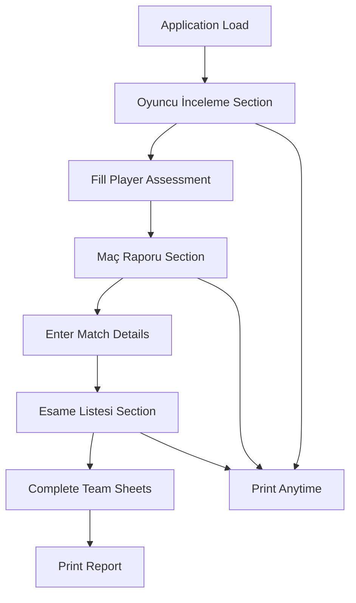

# Turkish Football Scouting Web Application - Product Requirements Document

## 1. Product Overview

A comprehensive single-page football scouting application designed for Turkish football scouts to evaluate players, record match reports, and manage team sheets efficiently. The application provides a clean, professional interface for documenting player assessments and match analysis in Turkish language.

The product serves professional football scouts, coaches, and analysts who need a streamlined digital tool for player evaluation and match reporting. It replaces traditional paper-based scouting methods with a modern, responsive web interface that works seamlessly across desktop and mobile devices while maintaining print-friendly formatting for official reports.

## 2. Core Features

### 2.1 User Roles

This application is designed as a single-user tool without role-based access control. All users have full access to all features for creating and editing scouting reports.

### 2.2 Feature Module

Our Turkish football scouting application consists of the following main sections:

1. **Oyuncu İnceleme (Player Review)**: Comprehensive player evaluation with technical, tactical, physical and mental assessment areas
2. **Maç Raporu (Match Report)**: Detailed match information including teams, scores, conditions, and scout details  
3. **Esame Listesi (Team Sheet)**: Interactive team lineups with player details, substitutions, goals, and ratings

### 2.3 Page Details

| Page Name | Module Name | Feature description |
|-----------|-------------|---------------------|
| Main Application | Header Section | Display "Emre Acet Scouting" branding with purple theme and professional styling |
| Oyuncu İnceleme | Genel Bakış | Large textarea for general player overview including position, role, and match behavior |
| Oyuncu İnceleme | Teknik & Taktik Güçlü Yanları | Textarea for documenting player's technical and tactical strengths |
| Oyuncu İnceleme | Geliştirilmesi Gereken Alanlar | Textarea for areas requiring technical and tactical development |
| Oyuncu İnceleme | Fiziksel ve Zihinsel Özellikler | Textarea for physical and mental characteristics assessment |
| Maç Raporu | Match Strip | Team names input fields with score inputs and "vs" display for match header |
| Maç Raporu | Scout Information | Scout name input field with prominent styling for identification |
| Maç Raporu | Match Details Grid | Tournament name, weather conditions, stadium, pitch conditions, and date inputs |
| Esame Listesi | Team Sheet Header | Duplicate match strip showing team names and scores for consistency |
| Esame Listesi | Technical Director Inputs | Separate input fields for each team's technical director |
| Esame Listesi | Interactive Tables | Two side-by-side editable tables with columns for player number, name, substitutions, goals, and ratings |

## 3. Core Process

**Main User Flow:**
The scout begins by accessing the single-page application and proceeds through three sequential sections. First, they complete the player review section by filling out textareas for general observations, strengths, development areas, and physical/mental characteristics. Next, they move to the match report section where they input team names, scores, scout information, and match conditions. Finally, they complete the team sheets by entering technical directors and filling out detailed player information in the interactive tables.

**Print Workflow:**
Users can print the completed report at any time, with the application automatically formatting content across multiple A4 pages with proper page breaks between sections.

## 4. User Interface Design

### 4.1 Design Style

- **Primary Color**: Purple (#5b3a8e) for headers, accents, and branding elements
- **Secondary Colors**: White background, light gray (#f5f5f5) for section backgrounds, dark gray (#333) for text
- **Button Style**: Clean, modern buttons with subtle shadows and purple accents
- **Font**: System fonts (Arial, Helvetica, sans-serif) for maximum compatibility and readability
- **Layout Style**: Centered container design with maximum width of 1000-1100px, card-based sections with subtle shadows
- **Icon Style**: Minimal use of icons, focus on clear typography and clean borders

### 4.2 Page Design Overview

| Page Name | Module Name | UI Elements |
|-----------|-------------|-------------|
| Header | Branding Bar | Purple background (#5b3a8e), white centered text, vertical padding for prominence |
| Oyuncu İnceleme | Section Layout | Two-column desktop layout collapsing to single column on mobile, large textareas (5-7 rows) with clear labels |
| Oyuncu İnceleme | Input Styling | Full-width textareas with light borders, focus states with purple accent, placeholder text in Turkish |
| Maç Raporu | Match Strip | Centered horizontal layout with team inputs, circular score displays, and "vs" separator |
| Maç Raporu | Form Grid | Two-column grid on desktop, single column on mobile, consistent input styling with labels above |
| Esame Listesi | Table Design | Side-by-side tables with bold headers, light borders, editable cells, responsive stacking on mobile |
| Print Layout | Page Breaks | Clean borders, proper spacing, page-break-before/after for section separation on A4 pages |

### 4.3 Responsiveness

The application follows a desktop-first approach with mobile-adaptive design. Two-column layouts automatically collapse to single columns on screens smaller than 768px. Touch interaction is optimized for mobile devices with larger touch targets and appropriate spacing. Print styles ensure clean formatting across A4 pages with proper margins and page breaks.