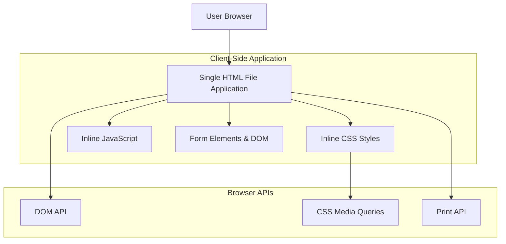
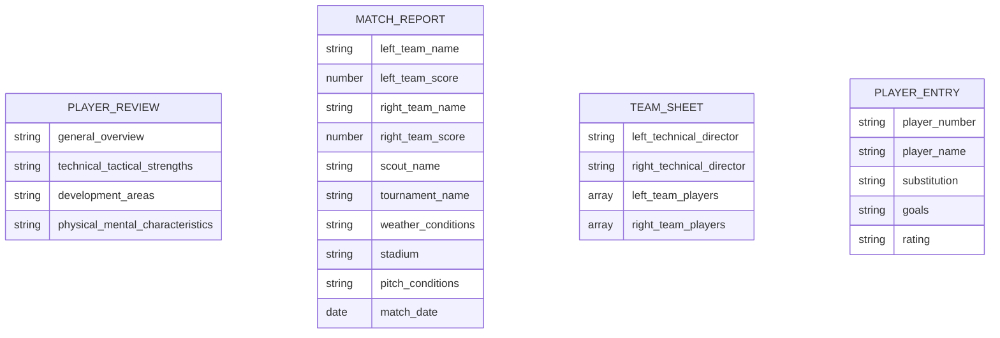

# Turkish Football Scouting Web Application - Technical Architecture Document

## 1. Architecture Design



## 2. Technology Description

- Frontend: Vanilla HTML5 + CSS3 + JavaScript (ES6+)
- Backend: None (client-side only application)
- External Dependencies: None (no libraries or frameworks)

## 3. Route Definitions

| Route | Purpose |
|-------|---------|
| / (index.html) | Single-page application containing all scouting functionality |

Note: This is a single-page application without routing. All functionality is contained within one HTML file with different sections managed through DOM manipulation and CSS styling.

## 4. API Definitions

This application does not include backend services or external APIs. All functionality is handled client-side through JavaScript DOM manipulation and form interactions.

## 5. Data Model

### 5.1 Data Model Definition

The application uses client-side JavaScript objects to manage form data temporarily during user interaction. No persistent storage is implemented in Phase 1.



### 5.2 Data Structure Implementation

The application uses JavaScript objects to temporarily store form data:

```javascript
// Player Review Data Structure
const playerReview = {
  generalOverview: '',
  technicalTacticalStrengths: '',
  developmentAreas: '',
  physicalMentalCharacteristics: ''
};

// Match Report Data Structure
const matchReport = {
  leftTeamName: '',
  leftTeamScore: 0,
  rightTeamName: '',
  rightTeamScore: 0,
  scoutName: '',
  tournamentName: '',
  weatherConditions: '',
  stadium: '',
  pitchConditions: '',
  matchDate: ''
};

// Team Sheet Data Structure
const teamSheet = {
  leftTechnicalDirector: '',
  rightTechnicalDirector: '',
  leftTeamPlayers: Array(16).fill({
    number: '',
    name: '',
    substitution: '',
    goals: '',
    rating: ''
  }),
  rightTeamPlayers: Array(16).fill({
    number: '',
    name: '',
    substitution: '',
    goals: '',
    rating: ''
  })
};
```

Note: Phase 2 will implement localStorage for data persistence and export functionality.